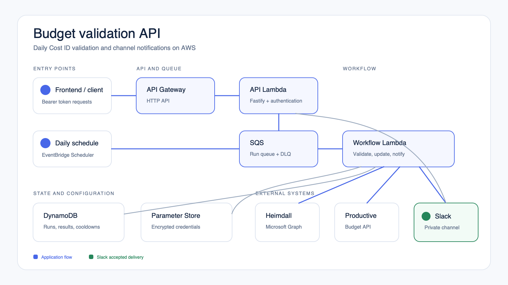

# Architecture



## Request flow

1. A user starts a run through the authenticated Fastify API, or EventBridge starts the daily run.
2. The request is placed on SQS. The workflow Lambda handles one run at a time.
3. The worker reads Cost IDs from Heimdall and checks the matching Productive budgets.
4. Run state, results, notification history, and the seven-day cooldown are stored in DynamoDB.
5. Confirmed invalid budgets are posted to the Slack channel connected to the incoming webhook. Each message shows the Cost ID and affected owner near the top.

## Slack

The webhook is stored at `/budget-validation/<environment>/SLACK_WEBHOOK_URL` as an SSM `SecureString`. Its value is not part of the Lambda environment or CloudFormation template.

There are two send paths:

- `POST /v1/notifications/test` sends a test message immediately. It requires an `operator` or `admin` access token.
- A non-dry-run validation sends an invalid-budget notification. A successful delivery starts the seven-day owner and Cost ID cooldown.

This integration is intentionally channel-only. It does not search Slack users or send direct messages. If Heimdall has no owner, the channel message shows `Not assigned` instead of suppressing the warning.

Example:

```sh
curl -X POST "$API_URL/v1/notifications/test" \
  -H "Authorization: Bearer $TOKEN" \
  -H 'Content-Type: application/json' \
  -d '{"message":"Backend webhook check"}'
```

A successful response means Slack accepted the message:

```json
{"status":"sent","requestId":"..."}
```

## AWS resources

- API Gateway HTTP API
- API Lambda and workflow Lambda
- SQS queue and dead-letter queue
- EventBridge Scheduler
- DynamoDB
- SSM Parameter Store with `SecureString`
- CloudWatch logs, metrics, alarms, and dashboard

The stack does not use ECS, Fargate, a VPC, Secrets Manager, or Cognito.
